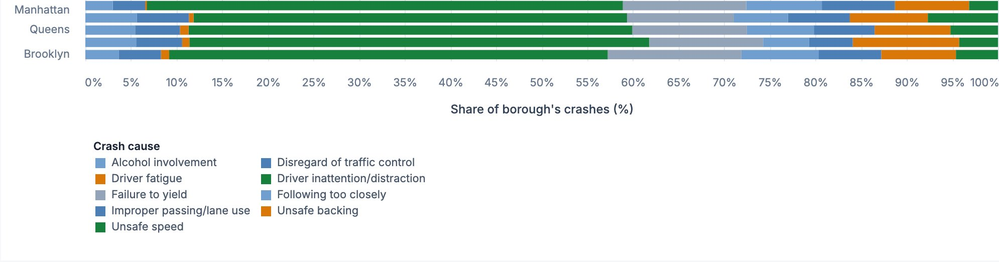
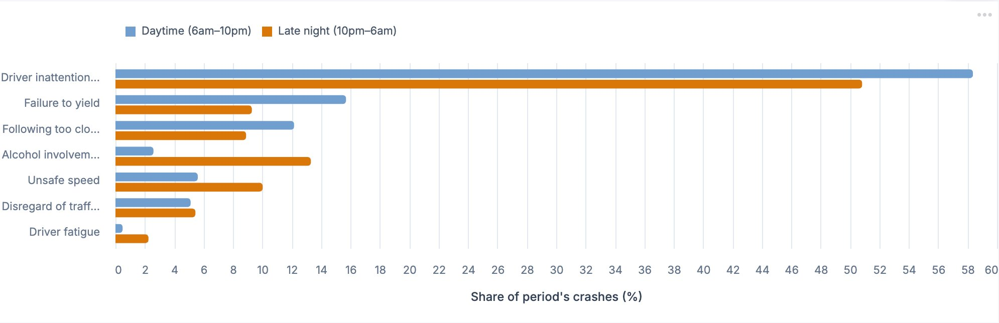
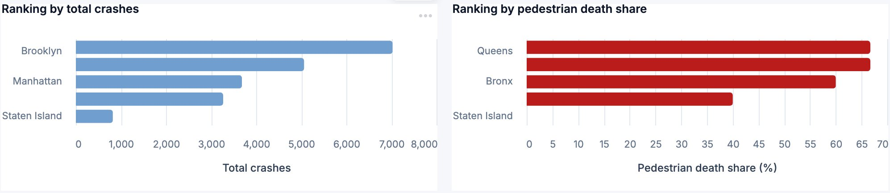

# NYC Traffic Safety Intelligence Dashboard

**Course:** DSPC A6000 — Advanced Computing for Policy  
**Team:** sparkly-pickle · Yiran Ge · Yizi Qu  
**Live Dashboard:** [sparkly-pickle.streamlit.app](https://sparkly-pickle-vluncnqsyee7xht3my7b7m.streamlit.app/)

---

## The Central Argument

NYC's traffic safety problem is not uniform. Crash causes, severity, and victim profiles look very different depending on which borough you're in and what time of day it is. A one-size-fits-all citywide policy will systematically under-serve the places and moments where risk is highest.

The dashboard diagnoses the problem in four modules and translates each finding into a concrete policy lever.

---

## Data Infrastructure

Two NYC Open Data datasets — **Motor Vehicle Collisions (Person)** and **Motor Vehicle Collisions (Crashes)** — are merged in real time via Google BigQuery, refreshed hourly. Merging them connects *cause* (what triggered the crash) with *outcome* (who was hurt, and how badly).

---

## Key Finding 1 — Pedestrians bear a disproportionate share of deaths

Pedestrians make up only **3.3%** of people involved in crashes, but **57.6%** of traffic deaths — a disproportionality index of **17.5**. Cyclists face a similar gap. Any policy focused on the average driver will fail to close this.

---

## Key Finding 2 — Where & When

### RQ1 — Do crash causes vary by borough?

Driver inattention dominates everywhere, but secondary causes diverge meaningfully across boroughs. A uniform citywide enforcement campaign misses these local differences.

### RQ2 — Do crash causes look different at night?

Late-night crashes show **1.8× more unsafe speed** (10.0% vs. 5.6% daytime) and higher alcohol involvement. The night-time problem is structurally different — daytime tools won't work after 10pm.

### RQ3 — Where are pedestrians most at risk?

The borough with the most total crashes (Brooklyn) is **not** the borough with the highest pedestrian death share (Queens). Funding pedestrian safety by crash volume alone sends money to the wrong places.

---

## Policy Levers

| Lever | Based On | Recommendation |
|-------|----------|---------------|
| Borough-specific enforcement | RQ1 | Each precinct targets its dominant local cause, not a citywide average |
| Time-segmented tactics | RQ2 | DWI checkpoints and speed enforcement at night; distraction cameras by day |
| Pedestrian budget allocation | RQ3 | Allocate protected crossings by pedestrian *death share*, not crash volume |

---

## Technical Stack

Python · Altair · Streamlit · Google BigQuery · GitHub Actions
